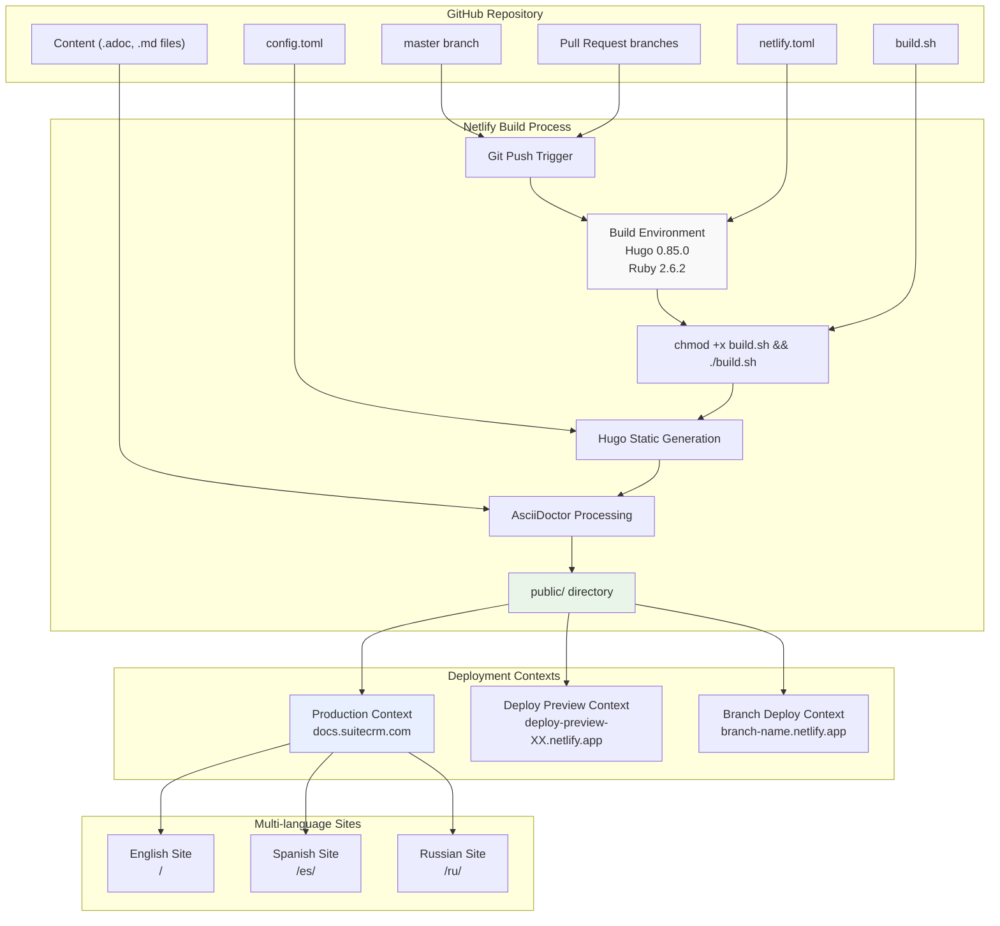
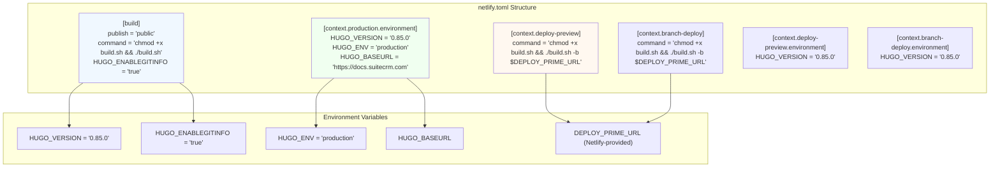
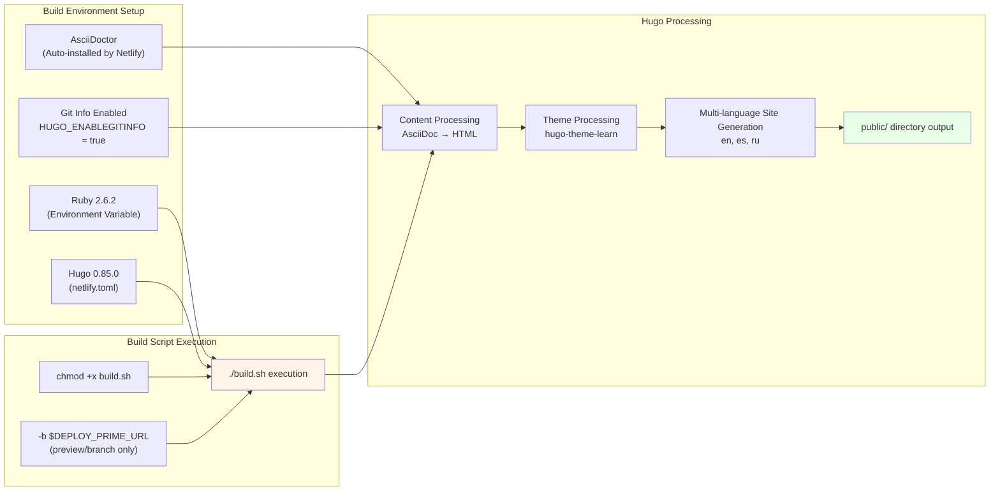
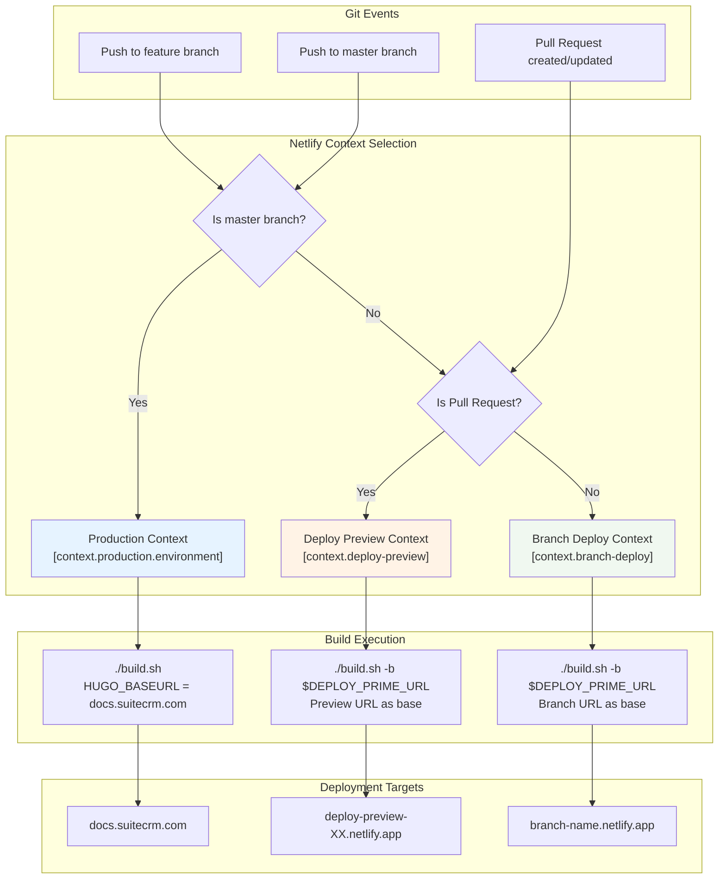
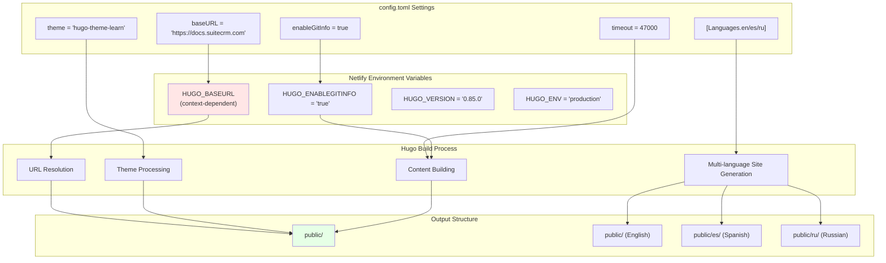

# Netlify Deployment

<details>
<summary>Relevant source files</summary>

The following files were used as context for generating this wiki page:

- [LICENSE.md](LICENSE.md)
- [README.md](README.md)
- [archetypes/blog.md](archetypes/blog.md)
- [archetypes/default.md](archetypes/default.md)
- [config.toml](config.toml)
- [content/community/contributing-code/Forking.adoc](content/community/contributing-code/Forking.adoc)
- [i18n/ru.toml](i18n/ru.toml)
- [netlify.toml](netlify.toml)

</details>


This document describes the Netlify deployment configuration and process for the SuiteDocs documentation system. It covers the automated deployment pipeline, build contexts, preview deployments, and integration with the Hugo static site generator.

The deployment system handles both production releases and preview deployments for pull requests, supporting multiple languages and automated builds triggered by GitHub commits. For information about the Hugo build process itself, see [Hugo Configuration and Build Process](#2.1). For details about multi-language content structure, see [Multi-language Support](#2.2).

## Deployment Architecture Overview

The SuiteDocs deployment system uses Netlify's continuous deployment platform to automatically build and deploy the Hugo-generated documentation site from the GitHub repository.

**Netlify Deployment Pipeline**


Sources: [README.md:13-17](), [netlify.toml:1-32](), [config.toml:1-43]()

## Netlify Configuration Structure

The deployment configuration is defined in `netlify.toml` which specifies build settings, deployment contexts, and environment variables for different deployment scenarios.

| Configuration Section | Purpose | Key Settings |
|----------------------|---------|--------------|
| `[build]` | Base build configuration | `publish = "public"`, build command |
| `[context.production.environment]` | Production environment variables | `HUGO_VERSION`, `HUGO_ENV`, `HUGO_BASEURL` |
| `[context.deploy-preview]` | Pull request preview settings | Custom build command with `$DEPLOY_PRIME_URL` |
| `[context.branch-deploy]` | Non-master branch deployments | Environment-specific base URL handling |

**Build Configuration Details**


Sources: [netlify.toml:3-32]()

## Build Process and Commands

The build process executes a shell script that handles Hugo compilation with AsciiDoc processing. The build command varies by deployment context to handle different base URL configurations.

### Build Command Execution Flow

**Production Build Command:**
```bash
chmod +x build.sh && ./build.sh
```

**Preview/Branch Build Command:**
```bash
chmod +x build.sh && ./build.sh -b $DEPLOY_PRIME_URL
```

The `build.sh` script (referenced but not provided in the file listing) processes the Hugo site generation with AsciiDoctor for `.adoc` file conversion. The `-b` flag allows dynamic base URL setting for preview deployments.

**Build Environment Configuration**


Sources: [netlify.toml:5-6](), [netlify.toml:17](), [netlify.toml:23](), [README.md:1-2]()

## Deployment Contexts and Environments

Netlify provides three distinct deployment contexts, each with specific configuration for different use cases in the documentation workflow.

### Production Context

The production context deploys from the `master` branch to the primary domain `docs.suitecrm.com`. This context includes full environment configuration for the live documentation site.

**Production Environment Variables:**
- `HUGO_VERSION = "0.85.0"`
- `HUGO_ENV = "production"`
- `HUGO_BASEURL = "https://docs.suitecrm.com"`

### Deploy Preview Context

Deploy previews are automatically generated for pull requests, providing a staging environment to review documentation changes before merging to master.

**Preview URL Pattern:** `deploy-preview-{PR_NUMBER}--suitedocs.netlify.app`

The preview context uses the `$DEPLOY_PRIME_URL` environment variable to ensure all internal links work correctly in the preview environment.

### Branch Deploy Context

Branch deployments create preview sites for any non-master branch pushed to GitHub, useful for long-running feature branches or collaborative documentation work.

**Branch URL Pattern:** `{BRANCH_NAME}--suitedocs.netlify.app`

**Deployment Context Flow**


Sources: [netlify.toml:9-14](), [netlify.toml:15-21](), [netlify.toml:22-28]()

## Integration with Hugo Configuration

The Netlify deployment system integrates closely with the Hugo site configuration defined in `config.toml`, particularly for multi-language support and theme processing.

### Hugo-Netlify Integration Points

| Hugo Configuration | Netlify Usage | Purpose |
|-------------------|---------------|---------|
| `baseURL = "https://docs.suitecrm.com"` | Overridden by `HUGO_BASEURL` | Production URL configuration |
| `theme = "hugo-theme-learn"` | Used in build process | Theme selection for Hugo |
| `timeout = 47000` | Build timeout setting | Long build time accommodation |
| `enableGitInfo = true` | Set via `HUGO_ENABLEGITINFO` | Git metadata in pages |
| Multi-language `[Languages]` | Deployed as subdirectories | `/`, `/es/`, `/ru/` paths |

**Hugo Configuration Integration**


Sources: [config.toml:1](), [config.toml:6](), [config.toml:10](), [config.toml:9](), [config.toml:28-118](), [netlify.toml:6](), [netlify.toml:13]()

## Status Monitoring and GitHub Integration

The deployment system includes status monitoring through GitHub badges and direct integration with the GitHub repository for automated builds and content editing workflows.

### GitHub Integration Features

The `config.toml` file defines several GitHub integration points that work with the Netlify deployment:

- **Edit Links:** `editURL = "https://github.com/salesagility/SuiteDocs/edit/master/content/"`
- **Issue Creation:** `issueURL = "https://github.com/salesagility/SuiteDocs/issues/new?"`
- **Repository Reference:** `GitHubRepo = "https://github.com/salesagility/SuiteDocs/"`

### Deployment Status Badge

The README displays a Netlify status badge that shows real-time deployment status:
```
[](https://app.netlify.com/sites/suitedocs/deploys)
```

This badge provides immediate visibility into the deployment state and links to the Netlify deployment dashboard for detailed build information.

Sources: [README.md:1-2](), [config.toml:14-16]()