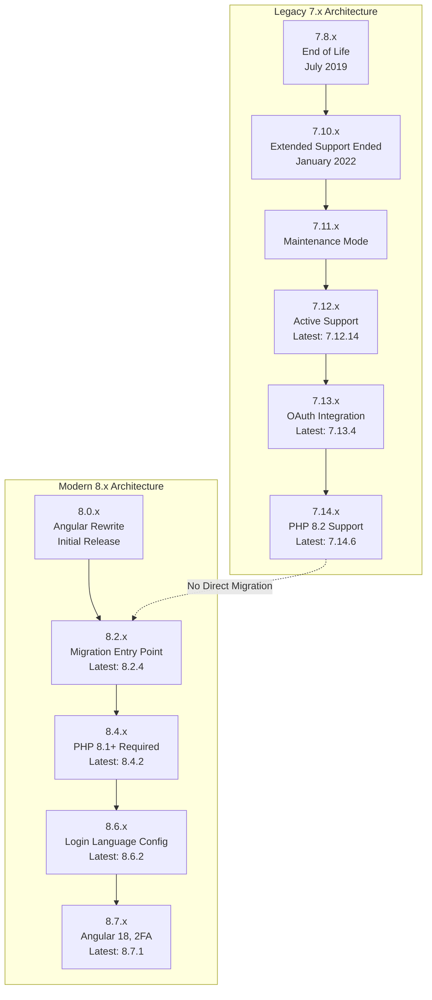
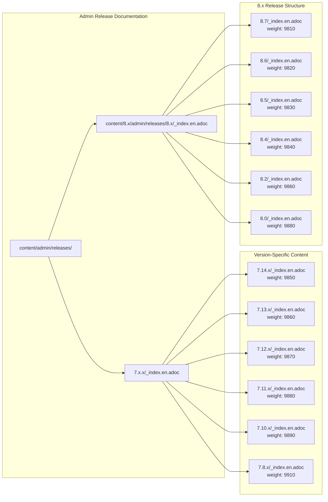
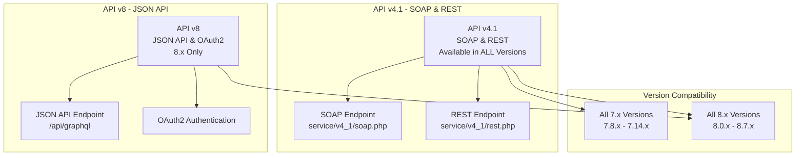
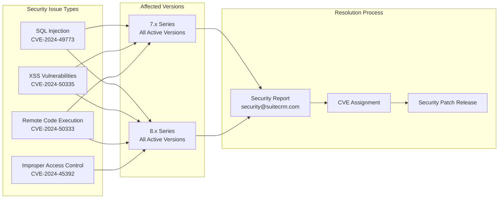
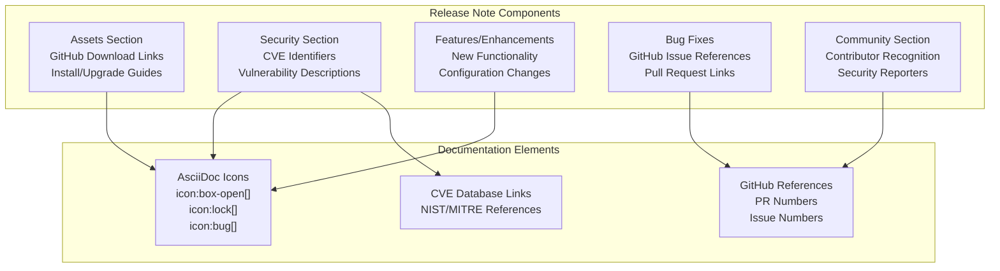

# SuiteCRM Version Documentation

Relevant source files

The following files were used as context for generating this wiki page:

- [.htmltest.yml](.htmltest.yml)
- [content/8.x/admin/releases/8.0/_index.en.adoc](content/8.x/admin/releases/8.0/_index.en.adoc)
- [content/8.x/admin/releases/8.1/_index.en.adoc](content/8.x/admin/releases/8.1/_index.en.adoc)
- [content/8.x/admin/releases/8.2/_index.en.adoc](content/8.x/admin/releases/8.2/_index.en.adoc)
- [content/8.x/admin/releases/8.3/_index.en.adoc](content/8.x/admin/releases/8.3/_index.en.adoc)
- [content/8.x/admin/releases/8.4/_index.en.adoc](content/8.x/admin/releases/8.4/_index.en.adoc)
- [content/8.x/admin/releases/8.5/_index.en.adoc](content/8.x/admin/releases/8.5/_index.en.adoc)
- [content/8.x/admin/releases/8.6/_index.en.adoc](content/8.x/admin/releases/8.6/_index.en.adoc)
- [content/8.x/admin/releases/8.7/_index.en.adoc](content/8.x/admin/releases/8.7/_index.en.adoc)
- [content/8.x/admin/upgrading/general-info.adoc](content/8.x/admin/upgrading/general-info.adoc)
- [content/admin/Advanced Configuration Options.adoc](content/admin/Advanced Configuration Options.adoc)
- [content/admin/releases/7.10.x/_index.en.adoc](content/admin/releases/7.10.x/_index.en.adoc)
- [content/admin/releases/7.11.x/_index.en.adoc](content/admin/releases/7.11.x/_index.en.adoc)
- [content/admin/releases/7.12.x/_index.en.adoc](content/admin/releases/7.12.x/_index.en.adoc)
- [content/admin/releases/7.13.x/_index.en.adoc](content/admin/releases/7.13.x/_index.en.adoc)
- [content/admin/releases/7.14.x/_index.en.adoc](content/admin/releases/7.14.x/_index.en.adoc)
- [content/admin/releases/7.8.x/_index.en.adoc](content/admin/releases/7.8.x/_index.en.adoc)
- [content/blog/_index.es.md](content/blog/_index.es.md)
- [content/developer/api/API-4_1.adoc](content/developer/api/API-4_1.adoc)
- [layouts/shortcodes/contribs.html](layouts/shortcodes/contribs.html)
- [layouts/shortcodes/dumpJSON.html](layouts/shortcodes/dumpJSON.html)
- [layouts/shortcodes/ghcontributors.html](layouts/shortcodes/ghcontributors.html)
- [static/images/en/8.x/admin/release/portal-user-enable-buttons.gif](static/images/en/8.x/admin/release/portal-user-enable-buttons.gif)
- [static/images/en/8.x/admin/release/preinstall-page-re-styled.png](static/images/en/8.x/admin/release/preinstall-page-re-styled.png)
- [static/images/en/8.x/admin/release/release-notes-field-actions-example.gif](static/images/en/8.x/admin/release/release-notes-field-actions-example.gif)
- [static/images/en/8.x/user/features/subpanels/Filter-Expanded.png](static/images/en/8.x/user/features/subpanels/Filter-Expanded.png)
- [static/images/en/8.x/user/features/subpanels/Filter-Full-Panel.png](static/images/en/8.x/user/features/subpanels/Filter-Full-Panel.png)
- [static/images/en/8.x/user/features/subpanels/Filter-Searched.png](static/images/en/8.x/user/features/subpanels/Filter-Searched.png)
- [static/images/en/admin/release/Externaloauth1.png](static/images/en/admin/release/Externaloauth1.png)
- [static/images/en/admin/release/Externaloauth2.png](static/images/en/admin/release/Externaloauth2.png)
- [static/images/en/admin/release/Externaloauth3.png](static/images/en/admin/release/Externaloauth3.png)
- [static/images/en/admin/release/InboundEmail1.png](static/images/en/admin/release/InboundEmail1.png)
- [static/images/en/admin/release/InboundEmail2.png](static/images/en/admin/release/InboundEmail2.png)
- [static/images/en/admin/release/InboundEmail3.png](static/images/en/admin/release/InboundEmail3.png)
- [static/images/en/admin/release/InboundEmail4.png](static/images/en/admin/release/InboundEmail4.png)
- [static/images/en/admin/release/InboundEmail5.png](static/images/en/admin/release/InboundEmail5.png)
- [static/images/en/admin/release/InboundOAuthConfiguration.png](static/images/en/admin/release/InboundOAuthConfiguration.png)
- [static/images/en/admin/release/OAuthMicrosoftConnection.png](static/images/en/admin/release/OAuthMicrosoftConnection.png)
- [static/images/en/admin/release/Outbound1.png](static/images/en/admin/release/Outbound1.png)
- [static/images/en/admin/release/Outbound2.png](static/images/en/admin/release/Outbound2.png)

This document provides a comprehensive overview of the SuiteCRM versions covered in the SuiteDocs documentation system. It serves as a reference for understanding the version landscape, release cycles, support status, and API evolution across both SuiteCRM 7.x and 8.x series.

For specific installation procedures, see [Installation Process](#5.1). For upgrade instructions between versions, see [Upgrade Procedures](#5.2). For API-specific documentation, see [API Documentation](#4).

## SuiteCRM Version Ecosystem

The SuiteCRM ecosystem spans two major architectural generations, each with distinct characteristics, support lifecycles, and development approaches.

### Version Architecture Overview

**Sources:** [content/admin/releases/7.8.x/_index.en.adoc](), [content/admin/releases/7.10.x/_index.en.adoc](), [content/admin/releases/7.11.x/_index.en.adoc](), [content/admin/releases/7.12.x/_index.en.adoc](), [content/admin/releases/7.13.x/_index.en.adoc](), [content/admin/releases/7.14.x/_index.en.adoc](), [content/8.x/admin/releases/8.0/_index.en.adoc](), [content/8.x/admin/releases/8.2/_index.en.adoc](), [content/8.x/admin/releases/8.4/_index.en.adoc](), [content/8.x/admin/releases/8.6/_index.en.adoc](), [content/8.x/admin/releases/8.7/_index.en.adoc]()

## Release Documentation Structure

The version documentation follows a hierarchical file structure that mirrors the SuiteCRM release organization:

### Documentation File Mapping

**Sources:** [content/admin/releases/7.14.x/_index.en.adoc:1-4](), [content/admin/releases/7.13.x/_index.en.adoc:1-4](), [content/admin/releases/7.12.x/_index.en.adoc:1-4](), [content/8.x/admin/releases/8.7/_index.en.adoc:1-6](), [content/8.x/admin/releases/8.6/_index.en.adoc:1-6]()

## Version Support Lifecycle

### SuiteCRM 7.x Series Status

| Version | Status | Last Release | End of Life | PHP Support |
|---------|--------|-------------|-------------|-------------|
| 7.8.x | End of Life | 7.8.31 (July 2019) | July 2019 | PHP 5.6+ |
| 7.10.x | End of Life | 7.10.36 (January 2022) | January 2022 | PHP 7.0+ |
| 7.11.x | Maintenance | 7.11.23 (November 2021) | Maintenance Mode | PHP 7.1+ |
| 7.12.x | Active | 7.12.14 (November 2023) | Active Support | PHP 7.4+ |
| 7.13.x | Active | 7.13.4 (July 2023) | Active Support | PHP 8.0+ |
| 7.14.x | Active | 7.14.6 (November 2024) | Active Support | PHP 8.2+ |

### SuiteCRM 8.x Series Status

| Version | Status | Last Release | Key Features | PHP Requirement |
|---------|--------|-------------|--------------|-----------------|
| 8.0.x | Superseded | 8.0.4 (March 2022) | Angular Rewrite | PHP 7.4+ |
| 8.2.x | Migration Entry | 8.2.4 (March 2023) | Migration Support | PHP 7.4+ |
| 8.4.x | Superseded | 8.4.2 (November 2023) | PHP 8.1+ Required | PHP 8.1+ |
| 8.6.x | Active | 8.6.2 (August 2024) | Login Language Config | PHP 8.1+ |
| 8.7.x | Active | 8.7.1 (November 2024) | Angular 18, 2FA | PHP 8.1+ |

**Sources:** [content/admin/releases/7.8.x/_index.en.adoc:14-16](), [content/admin/releases/7.10.x/_index.en.adoc:22](), [content/8.x/admin/releases/8.4/_index.en.adoc:185-189]()

## API Evolution Across Versions

### API Version Compatibility Matrix

**Sources:** [content/developer/api/API-4_1.adoc:14-18](), [content/developer/api/API-4_1.adoc:25-29]()

### API Authentication Methods

The authentication mechanisms vary significantly between API versions:

**API v4.1 Authentication:**
- Username/password authentication with MD5 hashing
- Session-based authentication using `login()` method
- Available in both SOAP and REST implementations

**API v8 Authentication:**
- OAuth2 with client credentials flow
- Bearer token authentication
- JWT token support for enhanced security

**Sources:** [content/developer/api/API-4_1.adoc:47-51]()

## Security and CVE Tracking

### Security Vulnerability Management

The documentation tracks security vulnerabilities using CVE (Common Vulnerabilities and Exposures) identifiers across all versions:

**Sources:** [content/admin/releases/7.14.x/_index.en.adoc:26-31](), [content/8.x/admin/releases/8.7/_index.en.adoc:29-34](), [content/admin/releases/7.12.x/_index.en.adoc:223-230]()

## Migration and Upgrade Paths

### Version Upgrade Complexity

The upgrade paths between versions vary significantly in complexity:

**Within 7.x Series:**
- Sequential upgrades generally supported (7.12.x → 7.13.x → 7.14.x)
- Minor version upgrades within series (7.14.5 → 7.14.6)
- Database schema updates handled automatically

**7.x to 8.x Migration:**
- No direct upgrade path available
- Complete system migration required
- Data migration tools provided for 8.2.0+
- Legacy mode available for compatibility

**Within 8.x Series:**
- Standard upgrade procedures between minor versions
- Breaking changes documented in release notes
- Configuration updates may be required

**Sources:** [content/8.x/admin/upgrading/general-info.adoc:14-17](), [content/8.x/admin/releases/8.4/_index.en.adoc:211-219]()

## Release Notes Structure

### Standard Release Documentation Format

Each version's release documentation follows a consistent structure implemented across all version files:

**Sources:** [content/admin/releases/7.14.x/_index.en.adoc:15-32](), [content/8.x/admin/releases/8.7/_index.en.adoc:17-34](), [layouts/shortcodes/ghcontributors.html:1-36]()

## Community Contribution Tracking

### Contributor Recognition System

The documentation system includes automated contributor recognition using GitHub usernames:

**GitHub Contributors Shortcode:**
- Implemented in `layouts/shortcodes/ghcontributors.html`
- Displays contributor avatars and GitHub profiles
- Used across all release notes for community recognition

**Community Contribution Categories:**
- Security vulnerability reporting
- Bug fixes and feature development
- Documentation improvements
- Translation and localization

**Sources:** [layouts/shortcodes/ghcontributors.html:23-34](), [content/admin/releases/7.14.x/_index.en.adoc:52-58]()