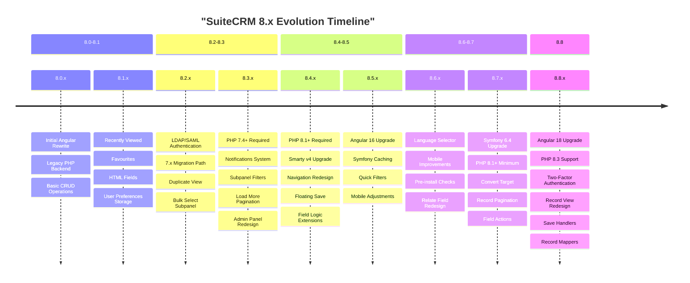
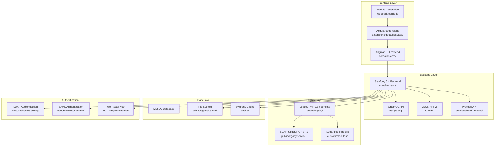
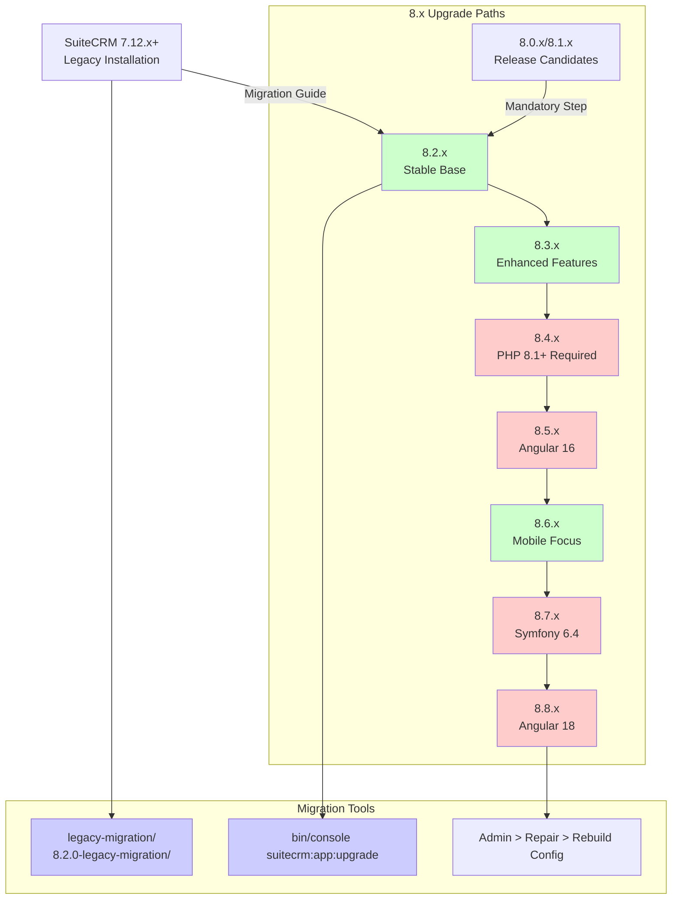
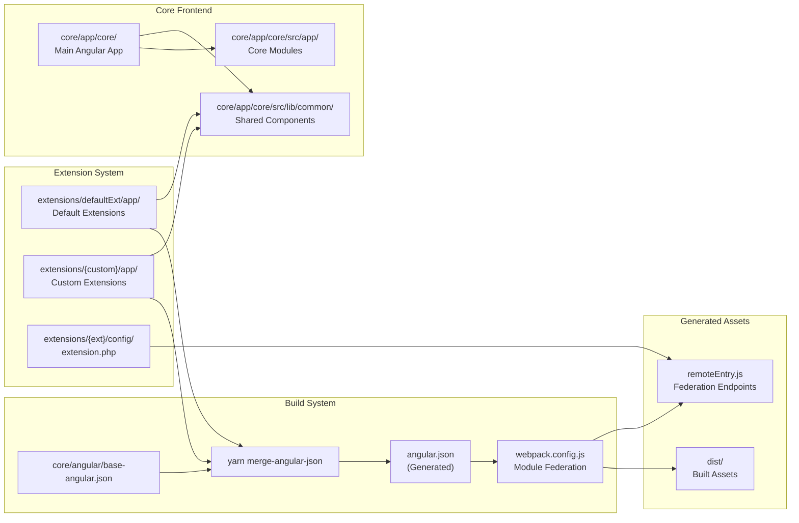
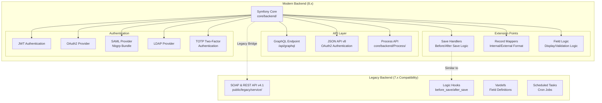

# SuiteCRM 8.x Series

Relevant source files

The following files were used as context for generating this wiki page:

- [content/8.x/_index.en.adoc](content/8.x/_index.en.adoc)
- [content/8.x/admin/Licensing.adoc](content/8.x/admin/Licensing.adoc)
- [content/8.x/admin/_index.en.adoc](content/8.x/admin/_index.en.adoc)
- [content/8.x/admin/_index.ru.adoc](content/8.x/admin/_index.ru.adoc)
- [content/8.x/admin/installation-guide/Downloading & Installing.adoc](content/8.x/admin/installation-guide/Downloading & Installing.adoc)
- [content/8.x/admin/installation-guide/Languages/install-a-new-language.adoc](content/8.x/admin/installation-guide/Languages/install-a-new-language.adoc)
- [content/8.x/admin/installation-guide/Languages/update-a-language-pack.adoc](content/8.x/admin/installation-guide/Languages/update-a-language-pack.adoc)
- [content/8.x/admin/installation-guide/Performance.en.adoc](content/8.x/admin/installation-guide/Performance.en.adoc)
- [content/8.x/admin/installation-guide/Uninstalling.adoc](content/8.x/admin/installation-guide/Uninstalling.adoc)
- [content/8.x/admin/releases/8.1/_index.en.adoc](content/8.x/admin/releases/8.1/_index.en.adoc)
- [content/8.x/admin/releases/8.2/_index.en.adoc](content/8.x/admin/releases/8.2/_index.en.adoc)
- [content/8.x/admin/releases/8.3/_index.en.adoc](content/8.x/admin/releases/8.3/_index.en.adoc)
- [content/8.x/admin/releases/8.4/_index.en.adoc](content/8.x/admin/releases/8.4/_index.en.adoc)
- [content/8.x/admin/releases/8.5/_index.en.adoc](content/8.x/admin/releases/8.5/_index.en.adoc)
- [content/8.x/admin/releases/8.6/_index.en.adoc](content/8.x/admin/releases/8.6/_index.en.adoc)
- [content/8.x/admin/releases/8.7/_index.en.adoc](content/8.x/admin/releases/8.7/_index.en.adoc)
- [content/8.x/admin/releases/8.8/_index.en.adoc](content/8.x/admin/releases/8.8/_index.en.adoc)
- [content/8.x/admin/upgrading/general-info.adoc](content/8.x/admin/upgrading/general-info.adoc)
- [content/8.x/developer/extensions/backend/save-handlers/_index.en.adoc](content/8.x/developer/extensions/backend/save-handlers/_index.en.adoc)
- [content/8.x/developer/extensions/frontend/migration/Migration-8.8.adoc](content/8.x/developer/extensions/frontend/migration/Migration-8.8.adoc)
- [content/8.x/developer/installation-guide/8.2.0-front-end-installation-guide.adoc](content/8.x/developer/installation-guide/8.2.0-front-end-installation-guide.adoc)
- [content/8.x/developer/installation-guide/8.8.0-front-end-installation-guide.adoc](content/8.x/developer/installation-guide/8.8.0-front-end-installation-guide.adoc)
- [content/8.x/features/two-factor/two-factor.en.adoc](content/8.x/features/two-factor/two-factor.en.adoc)
- [static/images/en/8.x/admin/install-guide/suite-cli-install-options.png](static/images/en/8.x/admin/install-guide/suite-cli-install-options.png)
- [static/images/en/8.x/admin/release/Fav-Filter.gif](static/images/en/8.x/admin/release/Fav-Filter.gif)
- [static/images/en/8.x/admin/release/Qr-2FA.png](static/images/en/8.x/admin/release/Qr-2FA.png)
- [static/images/en/8.x/admin/release/new-record-view.png](static/images/en/8.x/admin/release/new-record-view.png)
- [static/images/en/8.x/admin/release/portal-user-enable-buttons.gif](static/images/en/8.x/admin/release/portal-user-enable-buttons.gif)
- [static/images/en/8.x/admin/release/preinstall-page-re-styled.png](static/images/en/8.x/admin/release/preinstall-page-re-styled.png)
- [static/images/en/8.x/admin/release/release-notes-field-actions-example.gif](static/images/en/8.x/admin/release/release-notes-field-actions-example.gif)
- [static/images/en/8.x/user/features/2FA-Profile.png](static/images/en/8.x/user/features/2FA-Profile.png)
- [static/images/en/8.x/user/features/Disable-Two-Factor.gif](static/images/en/8.x/user/features/Disable-Two-Factor.gif)
- [static/images/en/8.x/user/features/Enable-2FA.png](static/images/en/8.x/user/features/Enable-2FA.png)
- [static/images/en/8.x/user/features/Enabled-2FA.png](static/images/en/8.x/user/features/Enabled-2FA.png)
- [static/images/en/8.x/user/features/Login-2FA.png](static/images/en/8.x/user/features/Login-2FA.png)
- [static/images/en/8.x/user/features/New-Disable-2FA.png](static/images/en/8.x/user/features/New-Disable-2FA.png)
- [static/images/en/8.x/user/features/QR-Code-Secret.png](static/images/en/8.x/user/features/QR-Code-Secret.png)
- [static/images/en/8.x/user/features/Qr-2FA.png](static/images/en/8.x/user/features/Qr-2FA.png)
- [static/images/en/8.x/user/features/Regenerate-Codes.gif](static/images/en/8.x/user/features/Regenerate-Codes.gif)

This document provides comprehensive coverage of the SuiteCRM 8.x series, including version evolution, architectural changes, upgrade paths, and development considerations. The 8.x series represents a complete architectural rewrite of SuiteCRM, transitioning from a traditional PHP application to a modern Angular frontend with Symfony backend.

For information about SuiteCRM 7.x series, see [SuiteCRM 7.x Series](#3.2). For API documentation covering both series, see [API Documentation](#4).

## Version Evolution and Timeline

The SuiteCRM 8.x series spans from 8.0.0 (initial release) through 8.8.0 (latest), with significant architectural changes throughout its evolution.

Sources: [content/8.x/admin/releases/8.4/_index.en.adoc:172-303](), [content/8.x/admin/releases/8.6/_index.en.adoc:214-335](), [content/8.x/admin/releases/8.8/_index.en.adoc:14-198]()

## System Architecture Overview

SuiteCRM 8.x employs a modern multi-tier architecture with clear separation between frontend, backend, and legacy components.

Sources: [content/8.x/admin/releases/8.7/_index.en.adoc:79-246](), [content/8.x/admin/releases/8.8/_index.en.adoc:40-198](), [content/8.x/developer/extensions/frontend/migration/Migration-8.8.adoc:1-117]()

## System Requirements Evolution

The 8.x series introduced progressive system requirement updates to support modern technologies.

| Version Range | PHP Version | Node.js | Angular | Symfony | Key Requirements |
|---------------|-------------|---------|---------|---------|-----------------|
| 8.0.x - 8.3.x | 7.4+ | 14.x | 12 | 5.4 | Initial requirements |
| 8.4.x | 8.1+ | 16.x | 14 | 5.4 | PHP 8.1 minimum |
| 8.5.x | 8.1+ | 18.x | 16 | 5.4 | Angular 16 upgrade |
| 8.6.x | 8.1+ | 18.x | 16 | 5.4 | Stability focus |
| 8.7.x | 8.1+ | 18.x | 16 | 6.4 | Symfony 6.4 upgrade |
| 8.8.x | 8.1+ (8.3 supported) | 20.11.1+ | 18 | 6.4 | Angular 18, Yarn 4.5+ |

Sources: [content/8.x/admin/releases/8.4/_index.en.adoc:185-191](), [content/8.x/admin/releases/8.7/_index.en.adoc:96-105](), [content/8.x/admin/releases/8.8/_index.en.adoc:52-62]()

## Migration and Upgrade Paths

SuiteCRM 8.x provides structured upgrade paths with version-specific requirements and breaking changes.

Sources: [content/8.x/admin/upgrading/general-info.adoc:32-79](), [content/8.x/admin/releases/8.2/_index.en.adoc:326-440]()

## Frontend Architecture and Extensions

The frontend architecture uses Angular with Module Federation for extensibility.

Sources: [content/8.x/developer/extensions/frontend/migration/Migration-8.8.adoc:21-117](), [content/8.x/developer/installation-guide/8.2.0-front-end-installation-guide.adoc:1-50]()

## Backend Components and APIs

The backend provides multiple API layers and extension points for different use cases.

Sources: [content/8.x/developer/extensions/backend/save-handlers/_index.en.adoc:1-58](), [content/8.x/admin/releases/8.7/_index.en.adoc:108-182](), [content/8.x/admin/releases/8.8/_index.en.adoc:97-153]()

## Key Features by Version

### Authentication and Security Features

The 8.x series progressively enhanced authentication capabilities:

- **8.2.x**: Introduced LDAP and SAML authentication with user auto-creation
- **8.6.x**: Added login language configuration and user profile language settings  
- **8.7.x**: Updated SAML implementation with new `Nbgrp` bundle and environment-based configuration
- **8.8.x**: Implemented TOTP-based two-factor authentication with backup codes

Configuration files: [core/backend/Security/](), [.env]() for SAML settings, [core/backend/Security/]() for LDAP.

### User Interface Enhancements

Major UI improvements across versions:

- **8.4.x**: Navigation bar redesign, floating save functionality, subpanel button widgets
- **8.5.x**: Quick filters implementation, mobile view adjustments with insights toggle
- **8.6.x**: Pre-install check page, relate field component redesign, mobile navigation improvements
- **8.7.x**: Convert target action, record pagination (VCR replacement), field-level action buttons
- **8.8.x**: Complete record view redesign with compact fields, subpanel redesign, timeline improvements

Sources: [content/8.x/admin/releases/8.4/_index.en.adoc:240-275](), [content/8.x/admin/releases/8.6/_index.en.adoc:233-295](), [content/8.x/admin/releases/8.8/_index.en.adoc:107-127]()

### Developer Extensions and APIs

The extension system evolved significantly:

- **8.3.x**: Process Handler Interface with `getRequiredACls` function
- **8.4.x**: Field logic operators, display logic configuration, panel logic
- **8.5.x**: Angular 16 migration requirements, frontend extension updates
- **8.7.x**: State Providers/Processors replacing Data Providers/Persisters
- **8.8.x**: Save Handlers, Record Mappers, common lib moved to `core/app/core/src/lib/common/`

Key files: [extensions/defaultExt/config/extension.php](), [webpack.config.js](), [angular.json]()

## Breaking Changes and Migration Considerations

### Major Breaking Changes by Version

**8.4.x Breaking Changes:**
- Minimum PHP version updated to 8.1
- `extensions/default` renamed to `extensions/defaultExt`
- `displayType` logic deprecated in favor of `displayLogic`

**8.5.x Breaking Changes:**
- Angular 16 upgrade requiring dependency updates
- Module Federation library version updates
- Frontend extension rebuild required

**8.7.x Breaking Changes:**
- Symfony 6.4 upgrade with API Platform 3.2
- SAML configuration structure changes
- Session handling updates removing `LEGACYSESSID`
- Doctrine DBAL method deprecations

**8.8.x Breaking Changes:**
- Angular 18 upgrade with zone.js disabled
- Common lib relocation to `core/app/core/src/lib/common/`
- Generated `angular.json` file (no longer version controlled)
- Subpanel widget configuration key change from `insightWidget` to `subpanelWidget`

Sources: [content/8.x/admin/releases/8.4/_index.en.adoc:194-218](), [content/8.x/admin/releases/8.7/_index.en.adoc:116-160](), [content/8.x/developer/extensions/frontend/migration/Migration-8.8.adoc:21-46]()

### Frontend Extension Migration

For extensions created before 8.8.x, migration steps include:

1. Update Node.js and Yarn to compatibility matrix versions
2. Copy configuration files from package: `angular.json`, `webpack.config.js`, etc.
3. Update common lib imports from `'common'` to `'core'`
4. Update `remoteEntry` paths in `extension.php` from `./extensions/` to `../extensions/`
5. Run `yarn merge-angular-json` to generate the angular.json file
6. Build extensions using `yarn build:extension <extension>`

Sources: [content/8.x/developer/extensions/frontend/migration/Migration-8.8.adoc:68-112]()

## Installation and Development Setup

### Installation Options

SuiteCRM 8.x provides multiple installation methods:
- **UI Installer**: Web-based installation with pre-install checks
- **CLI Installer**: Command-line installation for automated deployments
- **Dev Package**: Includes `dist` folder for extension development

Installation guide: [content/8.x/admin/installation-guide/Downloading & Installing.adoc:83-89]()

### Development Requirements

Development setup requires:
- Node.js 20.11.1+ (for 8.8.x)
- Yarn 4.5.0+ (for 8.8.x)
- PHP 8.1+ with required extensions
- MySQL 5.7+ or MariaDB 10.1+
- Composer 2.x+ for backend dependencies

Build commands:
- `yarn merge-angular-json`: Generate angular.json from base and extensions
- `yarn build:extension <name>`: Build specific extension
- `yarn build`: Production build
- `yarn build-dev`: Development build

Sources: [content/8.x/admin/releases/8.8/_index.en.adoc:52-62](), [content/8.x/developer/extensions/frontend/migration/Migration-8.8.adoc:47-67]()