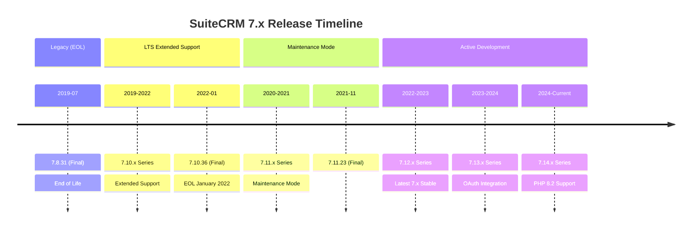
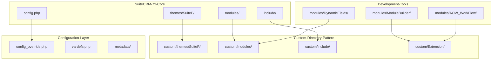
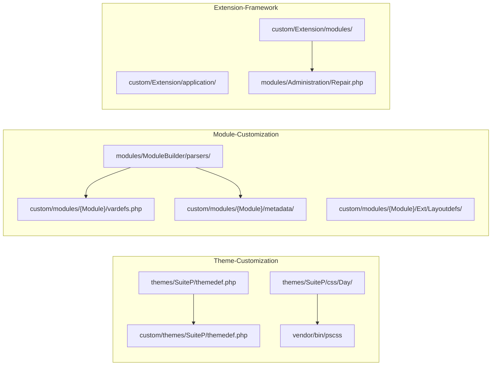
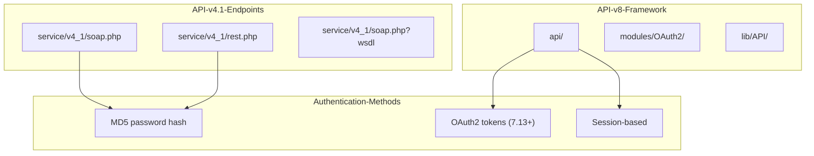
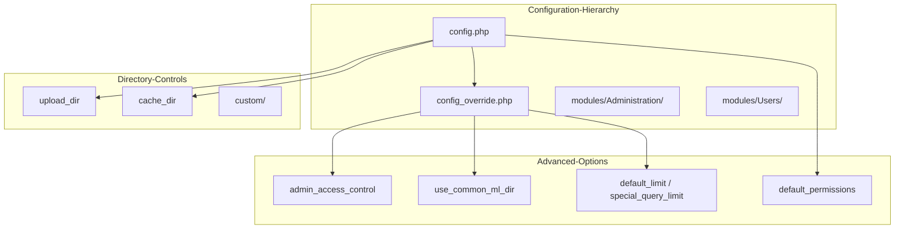
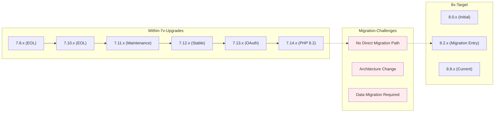

# SuiteCRM 7.x Series

Relevant source files

The following files were used as context for generating this wiki page:

- [.htmltest.yml](.htmltest.yml)
- [content/8.x/admin/releases/8.0/_index.en.adoc](content/8.x/admin/releases/8.0/_index.en.adoc)
- [content/admin/Advanced Configuration Options.adoc](content/admin/Advanced Configuration Options.adoc)
- [content/admin/releases/7.10.x/_index.en.adoc](content/admin/releases/7.10.x/_index.en.adoc)
- [content/admin/releases/7.11.x/_index.en.adoc](content/admin/releases/7.11.x/_index.en.adoc)
- [content/admin/releases/7.12.x/_index.en.adoc](content/admin/releases/7.12.x/_index.en.adoc)
- [content/admin/releases/7.13.x/_index.en.adoc](content/admin/releases/7.13.x/_index.en.adoc)
- [content/admin/releases/7.14.x/_index.en.adoc](content/admin/releases/7.14.x/_index.en.adoc)
- [content/admin/releases/7.8.x/_index.en.adoc](content/admin/releases/7.8.x/_index.en.adoc)
- [content/blog/Customizing-Subthemes.adoc](content/blog/Customizing-Subthemes.adoc)
- [content/blog/_index.es.md](content/blog/_index.es.md)
- [content/developer/api/API-4_1.adoc](content/developer/api/API-4_1.adoc)
- [layouts/shortcodes/contribs.html](layouts/shortcodes/contribs.html)
- [layouts/shortcodes/dumpJSON.html](layouts/shortcodes/dumpJSON.html)
- [layouts/shortcodes/ghcontributors.html](layouts/shortcodes/ghcontributors.html)
- [static/images/en/8.x/user/features/subpanels/Filter-Expanded.png](static/images/en/8.x/user/features/subpanels/Filter-Expanded.png)
- [static/images/en/8.x/user/features/subpanels/Filter-Full-Panel.png](static/images/en/8.x/user/features/subpanels/Filter-Full-Panel.png)
- [static/images/en/8.x/user/features/subpanels/Filter-Searched.png](static/images/en/8.x/user/features/subpanels/Filter-Searched.png)
- [static/images/en/admin/release/Externaloauth1.png](static/images/en/admin/release/Externaloauth1.png)
- [static/images/en/admin/release/Externaloauth2.png](static/images/en/admin/release/Externaloauth2.png)
- [static/images/en/admin/release/Externaloauth3.png](static/images/en/admin/release/Externaloauth3.png)
- [static/images/en/admin/release/InboundEmail1.png](static/images/en/admin/release/InboundEmail1.png)
- [static/images/en/admin/release/InboundEmail2.png](static/images/en/admin/release/InboundEmail2.png)
- [static/images/en/admin/release/InboundEmail3.png](static/images/en/admin/release/InboundEmail3.png)
- [static/images/en/admin/release/InboundEmail4.png](static/images/en/admin/release/InboundEmail4.png)
- [static/images/en/admin/release/InboundEmail5.png](static/images/en/admin/release/InboundEmail5.png)
- [static/images/en/admin/release/InboundOAuthConfiguration.png](static/images/en/admin/release/InboundOAuthConfiguration.png)
- [static/images/en/admin/release/OAuthMicrosoftConnection.png](static/images/en/admin/release/OAuthMicrosoftConnection.png)
- [static/images/en/admin/release/Outbound1.png](static/images/en/admin/release/Outbound1.png)
- [static/images/en/admin/release/Outbound2.png](static/images/en/admin/release/Outbound2.png)
- [static/images/en/developer/Admin-OAuth2Clients-2.png](static/images/en/developer/Admin-OAuth2Clients-2.png)
- [static/images/en/developer/Admin-OAuth2Clients-3.png](static/images/en/developer/Admin-OAuth2Clients-3.png)

This document covers the SuiteCRM 7.x series, including version history, technical architecture, release timeline, and upgrade paths. The 7.x series represents the traditional PHP-based architecture of SuiteCRM, in contrast to the Angular-based 8.x series covered in [SuiteCRM 8.x Series](#3.1). For compatibility information across versions, see [Version Compatibility Matrix](#3.3).

## Version Overview and Lifecycle

The SuiteCRM 7.x series spans from version 7.8.x through 7.14.x, with different branches serving various support lifecycles. The series maintains backward compatibility while introducing incremental improvements and security updates.

Sources: [content/admin/releases/7.8.x/_index.en.adoc:15-16](), [content/admin/releases/7.10.x/_index.en.adoc:22](), [content/admin/releases/7.11.x/_index.en.adoc:11-23](), [content/admin/releases/7.12.x/_index.en.adoc:11-14](), [content/admin/releases/7.13.x/_index.en.adoc:12-14](), [content/admin/releases/7.14.x/_index.en.adoc:12-14]()

## Technical Architecture Overview

SuiteCRM 7.x maintains a traditional PHP-based architecture with established customization patterns and upgrade-safe modification approaches.

Sources: [content/blog/Customizing-Subthemes.adoc:24-28](), [content/admin/Advanced Configuration Options.adoc:140-144]()

## Release Branch Characteristics

### 7.8.x Series (End of Life)
The final legacy branch before major architectural improvements.

| Characteristic | Details |
|---|---|
| **Final Version** | 7.8.31 (July 2019) |
| **Status** | End of Life |
| **PHP Support** | PHP 7.1-7.3 |
| **Key Features** | Basic SuiteP theme, traditional customization |

### 7.10.x Series (Extended Support Ended)
Long-term support branch with extended maintenance lifecycle.

| Characteristic | Details |
|---|---|
| **Final Version** | 7.10.36 (January 2022) |
| **Status** | Extended Support Ended |
| **PHP Support** | PHP 7.1-8.0 |
| **Key Security** | CVE-2021-45898, CVE-2021-45899, CVE-2021-45897 |

### 7.11.x Series (Maintenance Mode)
Transitional branch with limited feature development.

| Characteristic | Details |
|---|---|
| **Final Version** | 7.11.23 (November 2021) |
| **Status** | Maintenance Mode |
| **PHP Support** | PHP 7.2-8.0 |
| **Key Improvements** | ElasticSearch enhancements, security hardening |

### 7.12.x Series (Latest Stable)
Current stable production branch for 7.x deployments.

| Characteristic | Details |
|---|---|
| **Latest Version** | 7.12.14 (November 2023) |
| **Status** | Active Security Updates |
| **PHP Support** | PHP 7.4-8.1 |
| **Key Features** | Comprehensive security updates, performance improvements |

### 7.13.x Series (OAuth Integration)
Branch introducing modern authentication capabilities.

| Characteristic | Details |
|---|---|
| **Latest Version** | 7.13.4 (July 2023) |
| **Status** | Feature Complete |
| **PHP Support** | PHP 7.4-8.2 |
| **Key Features** | OAuth2 email integration, enhanced security |

### 7.14.x Series (Modern PHP Support)
Current development branch with latest PHP compatibility.

| Characteristic | Details |
|---|---|
| **Latest Version** | 7.14.6 (November 2024) |
| **Status** | Active Development |
| **PHP Support** | PHP 8.0-8.2 |
| **Key Features** | PHP 8.2 support, login language configuration |

Sources: [content/admin/releases/7.8.x/_index.en.adoc:15-16](), [content/admin/releases/7.10.x/_index.en.adoc:11-13](), [content/admin/releases/7.12.x/_index.en.adoc:11-14](), [content/admin/releases/7.14.x/_index.en.adoc:78-84]()

## Customization Architecture

SuiteCRM 7.x employs a well-established customization pattern using the `custom/` directory structure for upgrade-safe modifications.

Sources: [content/blog/Customizing-Subthemes.adoc:54-57](), [content/admin/Advanced Configuration Options.adoc:140-144]()

## API Evolution in 7.x Series

The 7.x series maintains the v4.1 API while introducing incremental improvements and security enhancements.

| API Version | Availability | Protocol Support | Authentication |
|---|---|---|---|
| **v4.1 SOAP** | All 7.x versions | SOAP/WSDL | Username/Password MD5 |
| **v4.1 REST** | All 7.x versions | JSON/Serialize | Username/Password MD5 |
| **v8 JSON API** | 7.10+ | JSON API spec | OAuth2 (7.13+) |

Sources: [content/developer/api/API-4_1.adoc:25-29](), [content/developer/api/API-4_1.adoc:93-97](), [content/admin/releases/7.13.x/_index.en.adoc:71-74]()

## Configuration Management

Advanced configuration in 7.x series utilizes multiple configuration layers for different deployment scenarios.

Sources: [content/admin/Advanced Configuration Options.adoc:26-30](), [content/admin/Advanced Configuration Options.adoc:44-47](), [content/admin/Advanced Configuration Options.adoc:55-57]()

## Migration and Upgrade Paths

The 7.x series provides clear upgrade paths within the branch family, but migration to 8.x requires significant planning due to architectural differences.

Sources: [content/admin/releases/7.14.x/_index.en.adoc:144-146](), [content/8.x/admin/releases/8.0/_index.en.adoc:86-88]()

## Security Evolution

The 7.x series has maintained active security updates with regular CVE addressing across all supported branches.

| Version Branch | Notable CVEs | Security Focus |
|---|---|---|
| **7.8.x** | CVE-2019-12601, CVE-2019-6506 | SQL Injection, XSS |
| **7.10.x** | CVE-2021-45898, CVE-2021-45899 | RCE, File Inclusion |
| **7.12.x** | CVE-2022-45185 | Access Control |
| **7.14.x** | CVE-2024-36416, CVE-2024-36415 | DOS, Access Control |

Sources: [content/admin/releases/7.8.x/_index.en.adoc:62-64](), [content/admin/releases/7.10.x/_index.en.adoc:26-30](), [content/admin/releases/7.12.x/_index.en.adoc:223-230](), [content/admin/releases/7.14.x/_index.en.adoc:147-167]()

## Current Status and Recommendations

As of 2024, the 7.x series remains in active development with the 7.14.x branch, while earlier branches have reached end-of-life or maintenance-only status. Organizations should plan migration strategies considering the architectural changes required for 8.x adoption.

- **Production Use**: 7.14.x for new deployments requiring 7.x architecture
- **Legacy Systems**: Upgrade path from 7.12.x → 7.13.x → 7.14.x recommended
- **Migration Planning**: 8.x migration requires comprehensive project planning due to architectural differences

Sources: [content/admin/releases/7.14.x/_index.en.adoc:12-14](), [content/admin/releases/7.12.x/_index.en.adoc:11-14]()